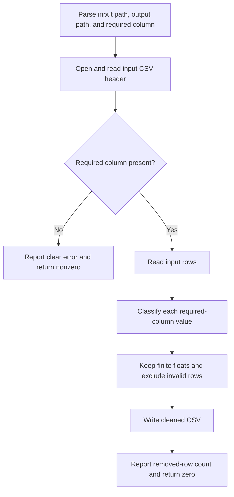

# CLI Application Code Map

## Scope

This map covers issue #1, which implements REQ-0001 and US-0001 through US-0005
inside AE-002, the CLI Application container.

## Module Map

| Module | Responsibility |
|---|---|
| `research_csv_cleaner.cli_application` | Parse CLI arguments, read the input CSV, classify required-column values, filter invalid rows, write the cleaned CSV, report removed-row count, and return process status. |

## Function Map

| Function | Responsibility | Approved behavior |
|---|---|---|
| `is_valid_numeric_value(value)` | Classify one required-column cell as valid only when it parses to a finite float. | US-0002, US-0003 |
| `clean_rows(rows, required_column)` | Filter invalid rows from in-memory CSV rows and count removals. | US-0002, US-0003, US-0005 |
| `clean_csv(input_path, output_path, required_column)` | Read CSV input, verify the required column before output creation, write cleaned output, and return removed count. | US-0001, US-0002, US-0003, US-0004, US-0005 |
| `build_parser()` | Define the minimal three-argument CLI. | DEC-001 |
| `main(argv)` | Execute the CLI workflow, print the result or error, and return an exit code. | DEC-001, US-0002, US-0005 |

## Runtime Flow

## Test Placement

| Test path | Purpose |
|---|---|
| `tests/unit/test_csv_cleaning_rules.py` | Numeric classification, row filtering, removal counting, and missing-column rule tests. |
| `tests/integration/test_cli_csv_cleaning.py` | End-to-end CLI/file behavior for successful cleaning and missing-column failure without output creation. |

## Constraints

- Use Python standard-library facilities only.
- Detect a missing required column before opening the output file for writing.
- Preserve default CSV behavior; dialect, encoding, malformed-file handling,
  overwrite and same-path behavior, and exact message wording remain outside
  the approved scope except where acceptance criteria require a clear error or
  removed-row count report.
