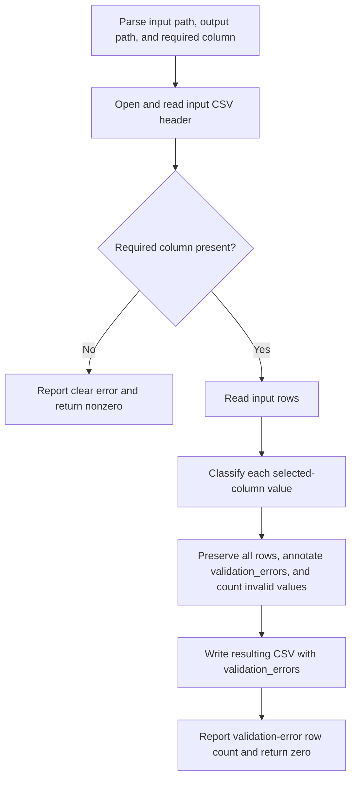

# CLI Application Code Map

## Scope

This map covers issue #1, which implements historical REQ-0001 and US-0001
through US-0005, issue #7, which implements REQ-0002 / US-0007, issue #8,
which implements REQ-0002 / US-0008, issue #9, which implements
REQ-0002 / US-0009, issue #10, which implements REQ-0002 / US-0010, issue
#12, which implements REQ-0002 / US-0012, and issue #17, which confirms
REQ-0002 / US-0017 inside AE-002, the CLI Application container.

## Module Map

| Module | Responsibility |
|---|---|
| `research_csv_cleaner.cli_application` | Parse CLI arguments, read the input CSV, classify selected-column values, preserve rows, annotate validation errors, write the resulting CSV, report the invalid-row count through the existing CLI shape, and return process status. |

## Function Map

| Function | Responsibility | Approved behavior |
|---|---|---|
| `validation_error_for_numeric_value(value, column)` | Return no error for finite floats; otherwise return a specific selected-column explanation for missing, empty, unparseable, NaN, or infinite values. | US-0007, US-0009 |
| `is_valid_numeric_value(value)` | Classify one selected-column cell as valid only when it parses to a finite float. | US-0002, US-0003, US-0007 |
| `clean_rows(rows, required_column)` | Validate one selected numeric column, preserve all in-memory CSV rows, populate `validation_errors`, and count invalid selected-column values. | US-0007, US-0008, US-0009, US-0012 |
| `clean_csv(input_path, output_path, required_column)` | Read CSV input, verify the selected column before output creation, validate that column, write the resulting CSV with all rows preserved and `validation_errors` included, and return the invalid-row count. | US-0001, US-0002, US-0004, US-0007, US-0008, US-0009, US-0010, US-0012, US-0017 |
| `build_parser()` | Define the minimal three-argument CLI. | DEC-001 |
| `main(argv)` | Execute the CLI workflow, print the validation-error row count or error, and return an exit code. | DEC-001, US-0002, US-0005, US-0012, US-0017 |

## Runtime Flow

## Test Placement

| Test path | Purpose |
|---|---|
| `tests/unit/test_csv_cleaning_rules.py` | Numeric classification, row preservation, validation-error annotation, invalid-row counting, and missing-column rule tests. |
| `tests/integration/test_cli_csv_cleaning.py` | End-to-end CLI/file behavior for resulting CSV row preservation, `validation_errors` output, validation-error row count reporting, existing command-shape continuity, and missing-column failure without output creation. |

## Constraints

- Use Python standard-library facilities only.
- Detect a missing required column before opening the output file for writing.
- Preserve default CSV behavior; dialect, encoding, malformed-file handling,
  overwrite and same-path behavior, and exact message wording remain outside
  the approved scope except where acceptance criteria require a clear error.
- Existing input `validation_errors` values are overwritten by generated
  validation results; preservation semantics for pre-existing error text are
  not specified in the approved requirements.
