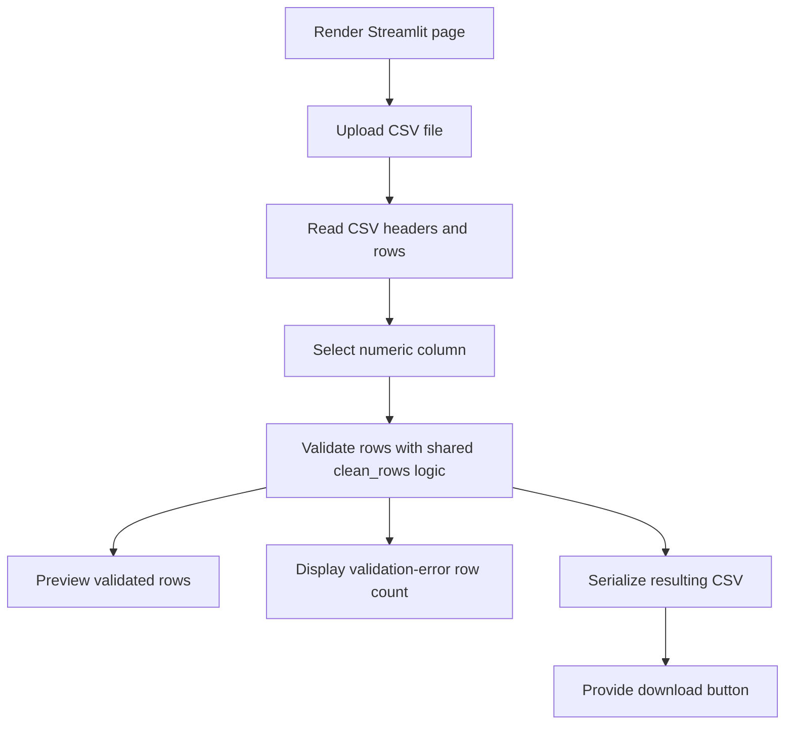

# Streamlit Interface Code Map

## Scope

This map covers issues #6, #11, #13, #14, #15, and #16, which implement
REQ-0002 Streamlit behavior inside AE-003, the Streamlit Interface container.

## Module Map

| Module | Responsibility |
|---|---|
| `research_csv_cleaner.streamlit_interface` | Accept an uploaded CSV, read headers and rows, let the researcher select a numeric column, call shared validation logic, preview validated rows, display validation-error row count, serialize the resulting CSV, and provide a download button. |
| `research_csv_cleaner.cli_application` | Own shared CSV validation semantics reused by the Streamlit interface. |

## Function Map

| Function | Responsibility | Approved behavior |
|---|---|---|
| `read_uploaded_csv(uploaded_file)` | Decode a Streamlit uploaded CSV and return fieldnames plus rows. | US-0006, US-0014 |
| `resulting_csv_text(rows, fieldnames)` | Serialize validated rows with `validation_errors` for download. | US-0011 |
| `main()` | Render upload, column selection, validation preview, validation-error row count, and resulting CSV download controls. | US-0013, US-0014, US-0015, US-0016, US-0011 |

## Runtime Flow

## Test Placement

| Test path | Purpose |
|---|---|
| `tests/integration/test_streamlit_interface.py` | Streamlit app integration behavior for upload, column selection, validated preview, validation-error row count display, and resulting CSV download serialization. |

## Constraints

- Reuse shared validation logic from the CLI application; do not duplicate
  numeric validation rules in the Streamlit module.
- Keep the interface local to Streamlit with no external services, database, or
  shared persistence.
- Preserve default CSV behavior; encoding, dialect, upload limits, and large-file
  guarantees remain outside approved scope.
